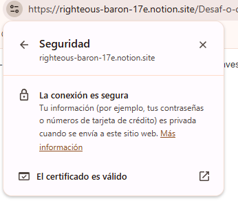

# **Alumno: Eduardo Andres Lizama Delgado  Cohorte: 22**

# 1. Diferencia entre HTTP y HTTPS

### ---SIGNIFICADOS---
### -HTTP:  Protocolo de Transferencia de Hipertexto (Hypertext Transfer Protocol)
### -HTTPS: Protocolo de Transferencia de Hipertexto Seguro (Hypertext Transfer Protocol Secure)

## ***Investiga cómo funciona el cifrado SSL/TLS en HTTPS.***

### "El cifrado SSL/TLS en HTTPS funciona mediante un proceso de "handshake" (saludo) que autentica al servidor y establece una conexión segura. Luego, utiliza una combinación de cifrado asimétrico (una clave pública para cifrar y una clave privada para descifrar) durante el saludo y cifrado simétrico (una clave de sesión secreta y temporal) para la transmisión de datos posteriores. Esto asegura que los datos transmitidos sean privados (cifrados) y que no hayan sido manipulados (integridad)." 

## ***¿Por qué HTTPS es más seguro?***

### Basicamente porque usa el cifrado de datos y un protocolo que verifica que la comunicacion entre nuestro dispositivo y el servidor es segura gracias a las llaves simetricas y asimetricas.

<!-- ## Muestra un ejemplo visual (puede ser una captura del candado del navegador).-->

  

## ***¿Qué sucede si un sitio no usa HTTPS?***

### "Si un sitio no usa HTTPS, los datos de los usuarios se transmiten sin cifrar, lo que los hace vulnerables a la interceptación por parte de atacantes, especialmente en redes Wi-Fi públicas." 
### Todo esto quiere decir que al no usar HTTPS nos encontramos vulnerables sufrir un robo de informacion, ya que no tenemos ninguna barrera de seguridad frente a posibles ataques de ciberdelincuentes.

# 2. Puertos de comunicación

## ***Explica qué es un puerto en redes y por qué es importante para HTTP.***

### Los puertos vendrian siendo las entradas o salidas(virtuales) por donde se va a comunicar nuestro pc. Son importantes para http porque nos ayudan a identificar con que tipo de aplicacion nos estamos comunicando, permiten la comunicacion con el servidor, sin puertos no podriamos enviar ni recibir datos y por ultimo facilita que se realicen multiples servicios a la vez porque cada uno usa su propio puerto de comunicacion de manera simultanea (por ejemplo, el puerto 25 para SMTP o el puerto 443 para HTTPS).

## ***Investiga el propósito de los puertos 80 y 8080, y qué tipo de tráfico suelen manejar.***

### Puerto 80
### Propósito: Es el puerto predeterminado para el protocolo HTTP. Se utiliza para la comunicación web no cifrada entre navegadores y servidores web.

### Puerto 8080

### Propósito: Funciona como un puerto HTTP alternativo. Es muy común en entornos de desarrollo local para probar sitios web antes de publicarlos.

### Ambos puertos manejan tráfico HTTP, pero el puerto 80 es el más habitual para la navegación web estándar.

## ***Menciona otros puertos conocidos (por ejemplo: 21, 22, 443, 3306) y su función.***

### Puerto 25 (SMTP): Se utiliza para el Protocolo Simple de Transferencia de Correo, principalmente para enviar correos electrónicos de un servidor a otro.
### Puerto 53 (DNS): El Sistema de Nombres de Dominio lo usa para convertir nombres de dominio como google.com en direcciones IP que las computadoras pueden entender.
### Puerto 110 (POP3): El Protocolo de Oficina de Correos versión 3 se usa para recuperar correos electrónicos de un servidor.
### Puerto 143 (IMAP): El Protocolo de Acceso a Mensajes de Internet se utiliza para acceder a correos electrónicos en un servidor remoto.
### Puerto 3389 (RDP): El Protocolo de Escritorio Remoto permite la conexión a un equipo a través de un escritorio remoto. 

## ***Ejemplo: ¿Qué puerto utiliza HTTPS por defecto?***

### HTTPS utiliza por defecto el puerto 443. Este es el puerto estándar para conexiones seguras en la web